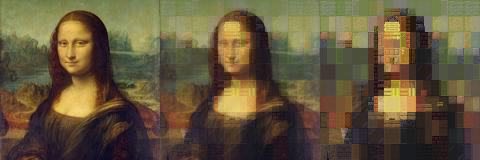

# AdeleBlock

## Overview
AdeleBlock is a Python program to convert pictures into Minecraft blocks. Rather than a pixel art approach where each pixel of the original painting is a single block, AdeleBlock chunks pictures into 16 x 16 sections and finds combinations of blocks that most closely match each one.

### Example, two layers:

### Example, three layers:

## How do I use it?
Right now, the only way to use the tool is to get the repo locally and to run `painting_converter.py` directly. Three Python packages are required to run this:
1. `pillow` is used for all image processing needs. Visit [Pillow's installation page](https://pillow.readthedocs.io/en/stable/installation/basic-installation.html) for installation info.
2. `numpy` is used for general math processing needs. Visit [Numpy's installation page](https://numpy.org/install/) for installation info.
3. `pyfftw` is used for the Fourier transform. Visit [PyFFTW's PyPI page](https://pypi.org/project/pyFFTW/) for installation info.
4. `tqdm` is used for the progress bar. Visit [tqdm's PyPI page](https://pypi.org/project/tqdm/) for installation info.

Your best bet is just going to be use a package manager like `pip` or `conda` for all requirements. A `requirements.txt` is provided for installation convenience.

**IMPORTANT NOTE**: When you run the program, it will ask if you wish to enable caching. This saves Fourier transform coefficient data to speed up processing, but the data takes up to __9 GIGABYTES__. Use this only if you are **absolutely certain** that you have that space to spare.

As you process an image, the `outputs` folder will contain a subfolder for your image with a variety of contents:
1. When the image is processing, progress images will regularly be saved.
2. Upon completion, the final blockified image will be saved here.
3. Separate images for just the backing blocks and the overlay blocks will be saved too.
4. Finally, a text file containing a list of the exact blocks used.

## How does it work?
AdeleBlock uses a Fourier transform-based approach to evaluate correlations between image chunks and many block combinations at once. For more information, I will add a math explainer soon.

## Name
The name AdeleBlock comes from a combination of the *Portrait of Adele Bloch-Bauer I (1903 - 1907)* by Gustav Klimt (commonly referred to as *The Lady in Gold* and *The Woman in Gold*), and, well, Minecraft blocks. I came up with the name on the spot because I wanted a combination Minecraft/art pun.