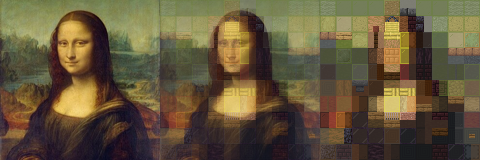

# AdeleBlock

## Overview
AdeleBlock is a Python program to convert pictures into Minecraft blocks. Rather than a pixel art approach where each pixel of the original painting is a single block, AdeleBlock chunks pictures into 16 x 16 sections and finds combinations of blocks that most closely match each one.

## How do I use it?
Right now, the only way to use the tool is to get the repo locally and to run `painting_converter.py` directly. Three Python packages are required to run this:
1. `pillow` is used for all image processing needs. Visit [Pillow's installation page](https://pillow.readthedocs.io/en/stable/installation/basic-installation.html) for installation info.
2. `numpy` is used for general math processing needs. Visit Numpy's installation page for installation info.
3. `pyfftw` is used for the Fourier transform. Visit PyFFTW's installation page for installation info.
Your best bet is just going to be use a package manager like `pip` or `conda` for all three.

When you run the program, it will will ask you for the image you wish to convert to blocks, and then the desired width and height in blocks.

Afterwards, it will ask if you wish to enable caching. **There may be important space constraints to this.** If caching is enabled, the program will save Fourier transform coefficient data in order to speed up painting processing. This speed-up comes at the heavy expense of space; cached data takes up to __9 GIGABYTES__. Use this only if you are **absolutely certain** that you have that space to spare.

With that choice made, the program will begin the process of conversion, and will print regular updates as to progress. If you wish to view progress, the `outputs` folder will contain a subfolder for your image that has a progress snapshot. This same folder will also contain the final blockified image upon completion, as well as a text file containing information about the blocks used.

## How does it work?
AdeleBlock uses a Fourier transform-based approach to evaluate correlations between image chunks and many block combinations at once. For more information, I will add a math explainer soon.

## Name
The name AdeleBlock comes from a combination of the *Portrait of Adele Bloch-Bauer I (1903 - 1907)* by Gustav Klimt (commonly referred to as *The Lady in Gold* and *The Woman in Gold*), and, well, Minecraft blocks. I came up with the name on the spot because I wanted a combination Minecraft/art pun.